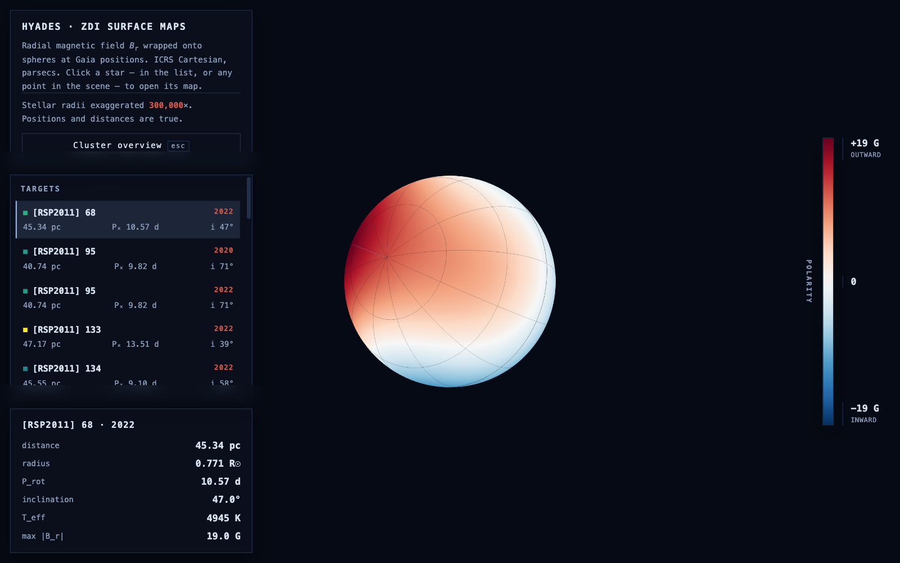

# ZDIviz

Zeeman-Doppler Imaging (ZDI) reconstructs the magnetic field across a star's
surface — but almost every published ZDI map is a flat Mollweide projection,
which throws away the spherical geometry the inversion actually recovered.
ZDIviz wraps these maps back onto spheres, placed at the stars' true 3D
positions from Gaia, and renders the result two ways from one pipeline:
OpenSpace scene assets for planetarium domes, and a self-contained three.js
page for any browser.

**Live preview:** https://federicachiti.github.io/ZDIviz/



## Preliminary data

The maps and stellar parameters shown here are preliminary. The full sample
and finalized values will be released once the associated paper is out:
Chiti et al. 2026b, *"Do K-dwarfs Really Stop Spinning Down? Insights from
Zeeman Doppler Imaging of Hyades Stars."*

## Run it

```bash
pip install -r requirements.txt
python build.py
```

Output goes to `docs/`. Open `docs/index.html` via a local server, not
`file://` — textures won't load otherwise:

```bash
python -m http.server -d docs 8000
```

## Status

The browser preview is built, rendered, and verified. The OpenSpace `.asset`
files follow the documented schema but haven't been loaded on a dome —
OpenSpace requires OpenGL 4.6, and this was built on hardware capped at 4.1.

## License

MIT — see [LICENSE](LICENSE).
